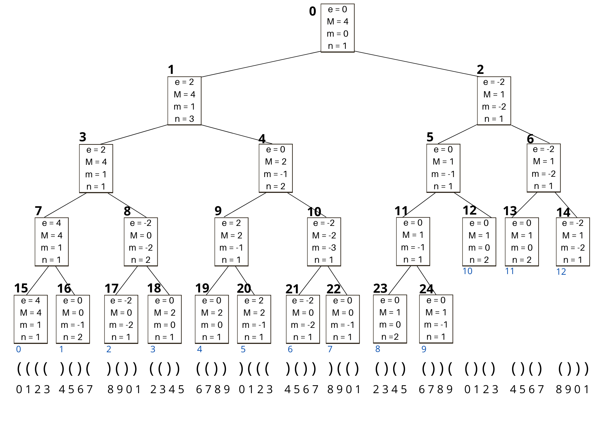
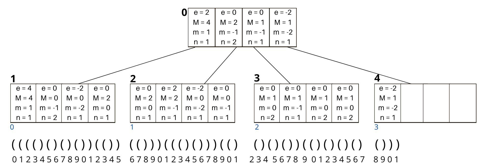

# Range min-Max tree (rmM-tree)

Esse repositório tem por objetivo apresentar parte[^1] da implementação da range min-Max tree binária proposta por [Sadakane e Navarro, 2010](https://github.com/DanyelleAngelo/rmm-tree/blob/main/README.md#refer%C3%AAncia), e da range min-Max tree k-ária, proposta no trabalho de conclusão de curso (TCC) de Bacharelado em Ciência da Computação pelo [Instituto Federal de Brasília - Câmpus Taguatinga](https://www.ifb.edu.br/taguatinga), sobre a orientação do professor Dr. [Daniel Saad Nogueira Nunes](https://github.com/DanielSaad).

<br>

[^1]: Para o projeto de conclusão de curso, foram implementadas 2 versões da rmM-tree k-ária (usando duas abordagens de percurso), este repositório contém apenas a versão que obteve melhor desempenho das duas. Além disso este repositório não incluí os testes de validação e de desempenho da range min-Max tree k-ária.
O trabalho completo pode ser encontrado [aqui](https://github.com/DanyelleAngelo/TCC).


## Range min-Max tree
<details>
<summary>Sobre a estrutura</summary>
<br><br>

A range min-Max tree viabiliza a realização de operações de percurso e busca sobre árvores codificadas por meio de sequência de parênteses balanceados. Como explica Navarro ([2016](https://github.com/DanyelleAngelo/rmm-tree/blob/main/README.md#refer%C3%AAncia)) , a rmM-tree é construída na forma de uma árvore binária completa, sendo que cada um de seus nós armazena valores de excesso (máximos, mínimos e global) calculados dentro de um intervalo de um vetor que representa a árvore de entrada.

A figura abaixo apresenta a rmM-tree binária (conforme o modelo original) para uma árvore de entrada _T_, na parte inferior da figura é possível encontrar a representação por meio de parênteses balanceados da árvore de entrada
<br>
<p align="center">
    
</p>
<br><br>
O objetivo deste trabalho era propor uma range min-Max tree com maior fator de ramificação, gerando em decorrência disso um melhor aproveitamento do príncipio de localidade espacial, visando contribuir para a melhoria do desempenho das operações suportadas pela rmM-tree.
A estrutura equivalente à mostrada acima, proposta neste trabalho, é exposta a seguir:
<br><br>
<p align="center">
    
</p>

<br><br>
O trabalho completo, bem como seus resultados, e descrições da implementação podem ser encontrados na [biblioteca do campus](http://siabi.ifb.edu.br//pesquisa?pag=1).
</details>

<details>
<summary>Operações suportadas</summary>
<br><br>
Abaixo listamos todas as operações suportadas pela nossa implementação de range min-Max tree binária e k-ária.<br>


|Operação            |rmM-tree binária |rmM-tree k-ária|
|        ---         |        ---      |      ---      |
|fwdSearch( i , d )      | Sim             |  Sim          |
|bwdSearch( i , d ) | Sim |  Sim |
|minExcess( i , j ) / maxExcess( i , j ) |  Sim | Não  |
|minCount( i , j ) |  Sim | Não |
|minSelectExcess( i , j, t ) | Sim | Não |
|enclose( i )| Sim |  Sim  |
|rmq( i , j ) / rMq( i , j )| Sim | Não  |
|rank<sub>1</sub>( i ) / rank<sub>0</sub>( i )| Sim |   Sim |
|select<sub>1</sub>( i ) / select<sub>0</sub>( i )| Sim |  Sim |
|preRank( i )/postRank( i )| Sim |  Sim |
|preSelect( i )/postSelect( i )| Sim |  Sim  |
|isLeaf( i )| Sim |  Sim |
|isAncestor( i , j )| Sim |  Sim |
|depth( i )|  Sim |  Sim |
|parent( i )| Sim |  Sim |
|firstChild( i ) / lastChild( i )| Sim |  Sim |
|child( i , t )|  Sim | Não  |
|nextSibling( i ) / prevSibling( i )|  Sim |  Sim |
|subtreeSize( i )|  Sim |  Sim |
|levelAncestor( i , d )|  Sim |  Sim  |
|levelNext( i ) / levelPrev( i )|  Sim |  Sim  |
|levelLeftMost( d ) / levelRightMost( d )| Sim |  Sim |
|lca( i , j )|  Sim | Não |
|deepestNode( i )|  Sim | Não  |
|degree( i )|  Sim | Não |
|childRank( i )|  Sim | Não |
|leafRank( i )|  Sim |  Sim |
|leafSelect( i )|  Sim |  Sim |
|leftMostLeaf( i )|   Sim |  Sim |
|rightMostLeaf( i )|   Sim |  Sim |
</details>

<details>
<summary>Como usar </summary>
<br><br>

Para fazer uso do projeto desenvolvido neste trabalho é necessário instalar a biblioteca *SDSL* ([Gog, et al., 2014](https://github.com/DanyelleAngelo/rmm-tree/blob/main/README.md#refer%C3%AAncia)), disponível em [simongog/sdsl-lite](https://github.com/simongog/sdsl-lite/tree/c32874cb2d8524119f25f3b501526fe692df29f4), a mesma oferece uma série de estruturas e operações usadas neste trabalho, como por exemplo estrutura de vetores de bits e operações de _rank_ e _select_.

Então após instalar a _SDSL_, para a estrutura binária, gere a sua biblioteca da seguinte forma:

```
g++ -std=c++11 -c binary-rmm-tree/binary-rmm-tree.cpp  -I ~/include  /usr/local/lib/libsdsl.a -lpthread -Wall -g 

ar crv librmmtreebin.a binary-rmm-tree.o
```

Repita o mesmo processo para gerar a biblioteca da estrutura k-ária.

Com as bibliotecas geradas, é possível fazer o uso das mesmas da seguinte forma:

```
g++ -o program program.cpp  librmmtreebin.a
./program
```

</details>

## Referências

- Sadakane, K. e Navarro, G. (2010). Fully-functional succinct trees. In Charikar, M., editor, Proceedings of the Twenty-First Annual ACM-SIAM Symposium on Discrete Algorithms, pages 134–149, Austin, Texas, USA. SIAM.

- Navarro, G. (2016). Compact data structures:a practical approach. Sheridan Books, Inc, New York, NY, USA, 1 edition

- Gog, S., Beller, T., Moffat, A., e Petri, M. (2014). From theory to practice: Plug and play with succinct data structures. In 13th International Symposium on Experimental Algorithms, (SEA 2014), pages 326–337.